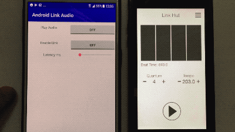

# AndroidLinkAudio

Bare minimum [Link](https://github.com/Ableton/link) integration within an Android audio App, using [Oboe](https://github.com/google/oboe) as the audio engine foundation.

## What the app does
Plays a click when a new bar starts. Also plays a sinewave just to make sure the audio engine is running properly.  When enabling Link, it joins a Link session, and the click should play in sync with other peers' start bar.



The latency slider sets the app *output latency*: on iOS, you can query the latency between the buffer timestamp and the actually time when it hits the speaker, which is required when syncing devices with Link. At the moment, this is done manually in the app, with this slider.

## Latency detection
In order to get an idea of the output latency on your device, you can start with detecting the [round-trip latency](https://source.android.com/devices/audio/latency_measurements#measurements), (ie. the input latency + app processing time + output latency). When switching on the round-trip detection button, the app will attempt to detect the time elapsed between the moment a click is written to an output buffer, and when it is detected in an input buffer. At this point the click detection is *extremely* crude, but it seems to work if you run it in a quiet environment (without a headset plugged in). In [this thread](https://github.com/google/oboe/issues/80), it is suggested that the output latency is the round-trip latency minus 3ms. However on the couple of devices I tested the detection, it seems that setting the latency to half the detected round-trip value and adding ~10 ms gives a good result for Link synchronisation. This is still pretty hacky and not very user friendly I'm afraid.

## Purpose of this repo
Serve as spring board code for Android audio apps needing Ableton Link support. Similar to the LinkHut app on iOS.

## Pull requests welcome
I'm putting this code out hoping that you smart people out there can help improving it. I'm trying to keep the API level somewhat low (currently 19).

Contributions on the following are especially welcome:
- Latency detection: how can the latency be set automatically? It seems there's some effort from the Oboe team for implementing this, but I'm not sure how to implement that for low API levels. Is it even possible?
- Link Session info: implement some C++ to Java callback to present alerts to the user when the peers count changes (like on iOS implementation).

## Building the app
- Link integration: see [notes from the non-audio test app](https://github.com/jbloit/androidLinkTest#building-the-app)
- Oboe: clone the [Oboe repo](https://github.com/google/oboe) and update the oboe path in the ```app/CMakeLists.txt``` file.
